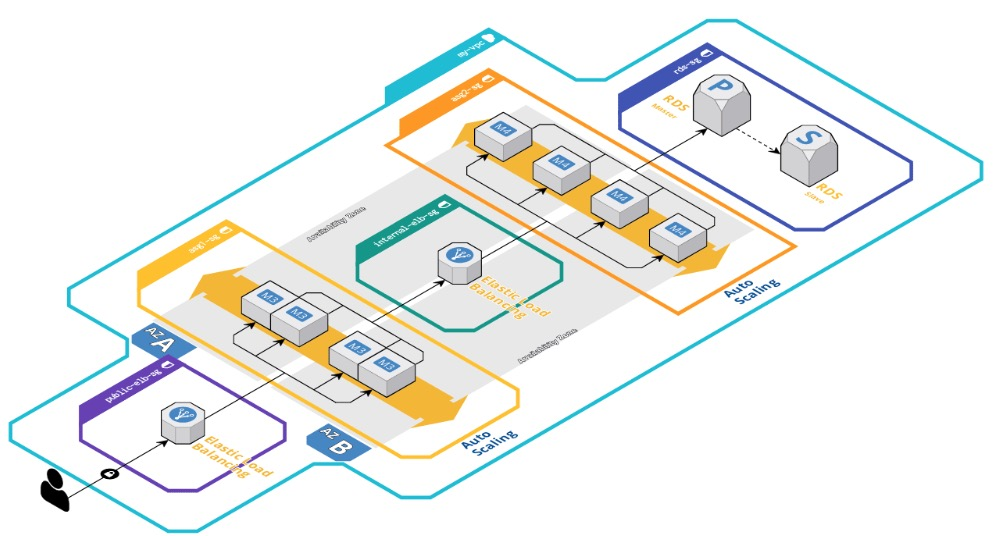

# Diagrams to code (d2c) - Infrastructure as code generator - from visual diagrams to Terraform


### [View all Roadmaps](https://github.com/nholuongut/all-roadmaps) &nbsp;&middot;&nbsp; [Best Practices](https://github.com/nholuongut/all-roadmaps/blob/main/public/best-practices/) &nbsp;&middot;&nbsp; [Questions](https://www.linkedin.com/in/nholuong/)
<br/> 

Code in this repository is used for generating infrastructure as Terraform configurations from visual diagrams created using [Cloudcraft](https://www.cloudcraft.co).


## How can I try this?

1. Sign up for a free account with [Cloudcraft](https://app.cloudcraft.co/signup).
1. Draw AWS architecture in web-browser (you can import live AWS resources, too).
1. Click "Export" and "Terraform code export" at the top right side.
1. Download archive and extract it locally.
1. Follow step-by-step instructions in `README.md` which you can find inside of it.


## How do the generated Terraform configurations look like?

In [modules.tf-demo](https://github.com/antonbabenko/modules.tf-demo) repository you can see the exact configuration code generated from sample "Web App Reference Architecture".

### Original infrastructure



### Recording of complete code execution

<a href="https://asciinema.org/a/32rkyxIBJ2K4taqZLSlKYNDDI" target="_blank"></a>

## Supporters

<a href="https://www.cloudcraft.co/" target="_blank"></a>

This project was partially sponsored by [Cloudcraft - the best way to draw AWS diagrams](https://www.cloudcraft.co).<br clear="all">

[](https://github.com/nholuongut/modules.tf-lambda)


## Developer's guide

This project is Python 3.8 serverless application written using [serverless.tf](https://serverless.tf) framework and open-source components ([Terraform AWS modules](https://github.com/nholuongut/terraform-aws-modules)).

### Notes for developers

Terraform is used to provision infrastructure resources as well as packaging artifacts and to do the deployments (check out [serverless.tf](https://serverless.tf) for more details).

Source code is located in `src/handler.py`.

Go to directory `terraform`, verify/update file `terraform.tfvars` and run:

```
$ terraform init     # Download required Terraform providers and modules
$ terraform apply    # Create or update infrastructure resources or do a new deployment of Lambda function (if source code has changed)
```

```
$ http --print Hhb --all --follow https://dev-d2c.modules.tf @test_fixtures/input/blueprint_my.json
```

# 🚀 I'm are always open to your feedback.  Please contact as bellow information:
### [Contact ]
* [Name: nho Luong]
* [Skype](luongutnho_skype)
* [Github](https://github.com/nholuongut/)
* [Linkedin](https://www.linkedin.com/in/nholuong/)
* [Email Address](luongutnho@hotmail.com)


[](https://ko-fi.com/nholuong)

# License
* Nho Luong (c). All Rights Reserved.🌟
